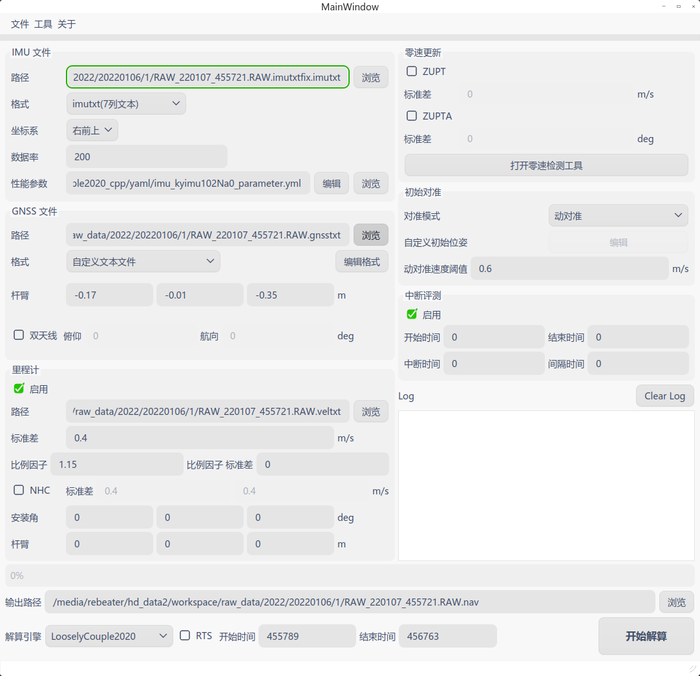

# RGIOE:A Real-time GNSS/INS/Odometer Integrated Navigation Algorithm based on Extend Kalman Filter
A Real-time GNSS/INS/Odometer Integrated Navigation Algorithm based on Extend Kalman Filter. 

# Description
This is an implementation of GNSS/INS/Odometer multi-sensor fusion algorithm base on extend Kalman filter. A high precise inertial mechanization is also implemented. We also take account of NHC and ZUPT. A C-tyle interface is provided for embedded applicatons.  We designed a console applicaiton and a UI version for a post-processing.  A real-time simulation based on ROS will be implemented soon. Brief ad follows:

1. Loosely coupled algorithm
2. High precise mechanization
3. Real-time and post-processing supported
4. EKF based

# Compile
The algorithm library (in Inc and Src  directory) is dependent and only relies on Eigen. To compile the library, you should install eigen on your computer by `apt install libeigen` ,or download its source code and tell the compiler where it is by `include_directory` in CMakelist.txt

To compile the executable program, you need to install the following library and all of them can be obtained by package manager :

1. [fmt](https://github.com/fmtlib/fmt.git)
2. [yaml-cpp](https://github.com/jbeder/yaml-cpp.git)
3. [glog](https://github.com/google/glog.git)
4. [Qt](https://www.qt.io/),包含qt-base,qt5-qwt,
# Usage
Both the executable console program and UI program is able to load the configure file in format of YAML. Some demo configure file are provided in directory `yaml` .  In terminal, you can use the following command:
```Plain Text
dataFusion <configure.yml>
```
The executable program `UiDataFusion` is easy to use. In UiDataFusion, you can use file->load to choose an configure. some of this feature is under development.

# C style API
To use this library in C environment such as STM32 and DSP, C style functions are provided.

```cpp
int navInitialize();
int navOutput(NavOutput *nav_output);
double navAlignGnss(const GnssData *gnss);
int navAlignLevel(const ImuData *imu);
void navSetGNSS(const GnssData *gnss);
void navSetVel(const Velocity *vel);
void navUpdate(const ImuData *imu);
```
# Performance
see Doc/performance.md


# 
